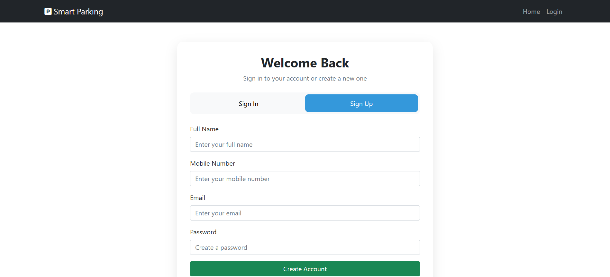
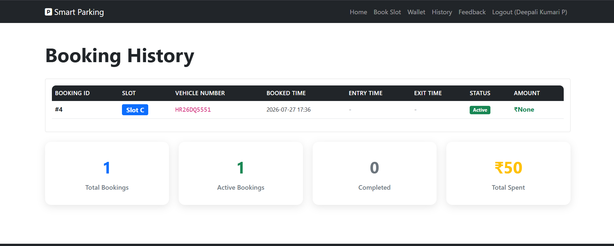
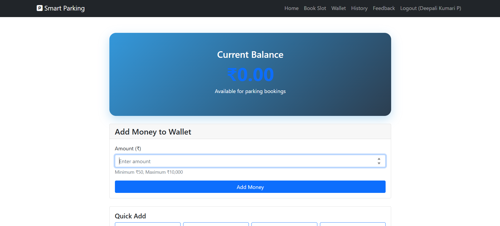

# AI Enabled Smart Parking System

A Smart Parking System developed using Python Flask and SQLite to simplify parking management. The system allows users to book parking slots, view parking history, provide feedback, and manage vehicle entry and exit.

## Features

- User Login
- Parking Slot Booking
- Vehicle Entry & Exit
- Parking History
- Wallet Management
- Feedback System
- SQLite Database Integration

## Technologies Used

- Python
- Flask
- SQLite
- HTML
- CSS
- JavaScript

## Project Structure

```
AI-Enabled-Smart-Parking-System/
│── app.py
│── database.py
│── Entrycode.py
│── Exitcode.py
│── parking.db
│── templates/
│── static/
```

## How to Run

1. Install Python.
2. Install Flask:
   ```
   pip install flask
   ```
3. Run the project:
   ```
   python app.py
   ```
4. Open your browser and visit:
   ```
   http://127.0.0.1:5000
   ```

 ##  Project Screenshots

### Login Page


### Parking Slot Booking


### Booking History


### Wallet


### Wallet - Add Money


## Author
Deepali Kumari P 
